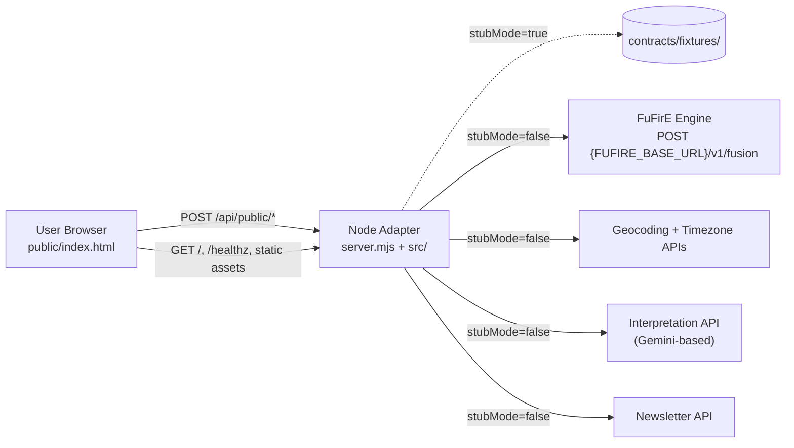
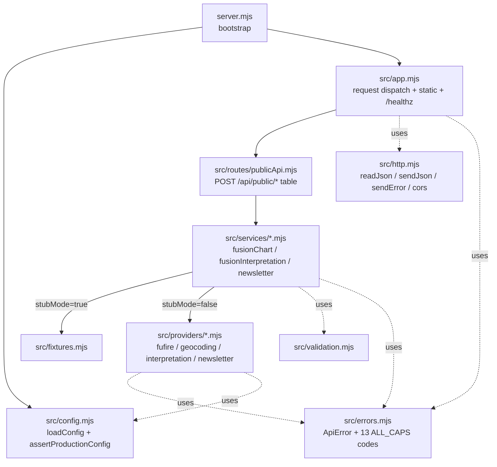

# Architecture

This document describes the Bazodiac FuFirE Fusion Preview as currently implemented (commit `7737da9`, code-derived baseline). Forward changes (e.g. real-provider integration via `GOAL-real-provider-integration`) extend this baseline without changing the contract surface.

## System Context

The system is a single same-origin Node process serving a static frontend and three POST endpoints. It runs in two modes selected by `PUBLIC_API_STUB_MODE`:

- **Stub mode** (default, dev/preview) — endpoints return deterministic JSON fixtures.
- **Live mode** (`PUBLIC_API_STUB_MODE=false`, production) — endpoints call upstream provider services. Production refuses to start if any required env var is missing (REQ-F-config-validation-live).

Same-origin deployment is mandated by `CON-same-origin-node-deployment`. The browser ↔ server boundary uses the public API contract documented in `contracts/public-api.md` (frozen at Iteration 2).

## Components

### Frontend (`public/index.html`)

Single-file artifact (~100 KB HTML/CSS/JS). Embeds the only `apiClient` the browser uses today. Bilingual DE/EN with live language switching; motion profiles; consent-gated newsletter flow; six chart tiles (keyboard-accessible per `REQ-USA-keyboard-accessible-tiles`). No bundler, no build step (`CON-active-frontend-public-index`). React variants in `archive/` are reference-only (`CON-react-archive-inactive`).

Renders backend `error.code` verbatim with no synthesized fallback (`REQ-USA-error-code-rendered-verbatim`, `CON-no-synthesized-data-in-prod`).

Editorial framing: chart-interpretation microcopy follows the editorial guideline at [`1-spec/editorial-voice.md`](../1-spec/editorial-voice.md), formalized by `REQ-USA-editorial-framing-reflection`. The guideline's 4 principles (rational-vor-mystisch, ehrlich-vor-versprechend, reflexiv-vor-deklarativ, negation-als-markenstimme) are reviewed by humans (or AI acting as reviewers) per PR; the soft-hint linter `scripts/check-editorial-voice.mjs` (invoked via `npm run editorial-hints`) surfaces watchword occurrences as non-fatal hints to assist review — explicitly NOT a build-gate. Words from the horoscope tradition are allowed in negating or redefining form ("Kein Horoskop-Versprechen. Eine Signatur."), which is canonical Bazodiac voice. Microtypography: essential UI text (`.stat .k`, `.wuxing-vec .lab`, `.wuxing-bars .el .name`, `.bento .ck .label`, `.bento .v small`, `.interpretation .kv span`, `.modal-foot .note`) uses ≥10px (`REQ-USA-no-8px-essential-text`).

### Adapter (`server.mjs` + `src/`)

Three internal layers plus cross-cutting infrastructure:

**Layer responsibilities:**

| Layer | Files | Responsibility |
|---|---|---|
| Bootstrap | `server.mjs` | Load config, assert production env, bind `PORT`/`HOST` (`REQ-MNT-railway-deploy-conformance`). |
| Dispatch | `src/app.mjs` | OPTIONS/CORS, `/healthz`, route lookup, static-with-SPA-fallback, method gating. |
| Routes | `src/routes/publicApi.mjs` | Read body, call service, send envelope. |
| Services | `src/services/*.mjs` | Validate input, branch on `config.stubMode`, orchestrate providers. **Stub mode short-circuit lives here**, not in routes or providers. |
| Providers | `src/providers/*.mjs` | Outbound integrations. Map public contract ↔ upstream schema. Throw `ApiError` with stable codes on failure (`REQ-REL-explicit-provider-failure`). |
| Cross-cutting | `src/{config,errors,http,validation,fixtures}.mjs` | Config validation (`REQ-F-config-validation-live`), error envelope (`REQ-F-stable-error-envelope`), JSON I/O, input validation, fixture loading. |

**Stub-vs-live boundary:** every service module is the *single* place where `config.stubMode` is read. Production code paths never read fixtures; this is enforced by the pattern `if (config.stubMode) return await loadFixture(...)` returning before any provider call. `REQ-F-no-fixture-fallback-in-prod` is satisfied because the production path has no try/catch that would swallow a provider error and hand back a fixture.

### Upstream Provider Services (external, out of repository)

| Provider | Protocol | Active constraint |
|---|---|---|
| FuFirE chart engine | `POST {FUFIRE_BASE_URL}/v1/fusion`, header `X-API-Key` | `CON-fufire-chart-endpoint` (Draft, awaiting re-approval), `REQ-F-fufire-chart-mapping`, `DEC-fufire-baseline`, `ASM-fufire-api-available` (Verified 2026-05-08) |
| Geocoding + Timezone | HTTP, vendor TBD | `ASM-geocoding-vendor-affordable` (Unverified Medium) |
| Interpretation (Gemini-based) | HTTP, vendor TBD | `ASM-interpretation-vendor-selectable` (Unverified Medium) |
| Newsletter | HTTP, vendor with double opt-in | `ASM-newsletter-vendor-gdpr-compliant` (Unverified Medium) |

## Cross-cutting Concerns

**Error envelope (`REQ-F-stable-error-envelope`).** All API responses use `{ok: true, ...}` or `{ok: false, error: {code, message, field?}}`. The 13 `error.code` values are a frozen set (`ERROR_CODES` in `src/errors.mjs`); adding or renaming requires a contract update.

**Configuration (`REQ-F-stub-mode-toggle`, `REQ-F-config-validation-live`, `REQ-COMP-stub-mode-prod-disabled`).** `loadConfig()` parses `process.env`; `assertProductionConfig()` runs at boot when `stubMode=false` and aborts startup with `CONFIGURATION_ERROR` listing every missing variable. Production deployment process must guarantee `PUBLIC_API_STUB_MODE=false` (`CON-stub-mode-dev-only`).

**Logging hygiene (`REQ-SEC-no-pii-in-logs`).** Logs and `error.message` strings must not contain user PII (birthDate, birthTime, birthPlace, email, name). Provider error mapping in `fufireProvider.mjs` returns generic strings; service-layer logging is intentionally minimal.

**i18n parity (`REQ-USA-i18n-de-en-parity`, `REQ-F-language-toggle-live`).** All visible UI text exists in DE+EN; the language toggle updates ARIA labels, tooltips, and chart tile content live without page reload. Backend echoes `language` only as a request field and does not localize error messages.

**Health and operations (`REQ-MNT-railway-deploy-conformance`).** `/healthz` returns `{ok: true, service: 'bazodiac-fusion-preview'}`. Single Node process, no native dependencies.

## Requirement Coverage Summary

All 18 Approved Must-have requirements and 5 Approved Should-have requirements are addressed by this architecture (Should-have rows marked `(SH)` in the Priority column):

| REQ | Covered by |
|---|---|
| [REQ-F-stable-error-envelope](../1-spec/requirements/REQ-F-stable-error-envelope.md) | `src/errors.mjs` `ApiError.toEnvelope()`; `src/http.mjs` `sendError` |
| [REQ-F-fusion-chart-endpoint](../1-spec/requirements/REQ-F-fusion-chart-endpoint.md) | Routes + `fusionChartService` + `fufireProvider` |
| [REQ-F-fusion-interpretation-endpoint](../1-spec/requirements/REQ-F-fusion-interpretation-endpoint.md) | Routes + `fusionInterpretationService` + `interpretationProvider` |
| [REQ-F-newsletter-signup-endpoint](../1-spec/requirements/REQ-F-newsletter-signup-endpoint.md) | Routes + `newsletterService` + `newsletterProvider` |
| [REQ-F-null-birth-time-accepted](../1-spec/requirements/REQ-F-null-birth-time-accepted.md) | `validation.mjs` accepts `null`; `fufireProvider.buildLocalDatetime` flags `provisional`; service blanks ascendant |
| [REQ-F-fufire-chart-mapping](../1-spec/requirements/REQ-F-fufire-chart-mapping.md) | `fufireProvider.buildFufireRequest` + `mapFufireResponse` |
| [REQ-F-stub-mode-toggle](../1-spec/requirements/REQ-F-stub-mode-toggle.md) | `config.mjs` reads `PUBLIC_API_STUB_MODE` |
| [REQ-F-config-validation-live](../1-spec/requirements/REQ-F-config-validation-live.md) | `assertProductionConfig` at boot |
| [REQ-F-no-fixture-fallback-in-prod](../1-spec/requirements/REQ-F-no-fixture-fallback-in-prod.md) | Stub branch returns before provider call; no try/catch fallback |
| [REQ-F-language-toggle-live](../1-spec/requirements/REQ-F-language-toggle-live.md) | Frontend (`public/index.html`) — backend agnostic |
| [REQ-REL-explicit-provider-failure](../1-spec/requirements/REQ-REL-explicit-provider-failure.md) | Providers throw `ApiError` with `*_UNAVAILABLE` codes; never return synthetic data |
| [REQ-SEC-consent-required](../1-spec/requirements/REQ-SEC-consent-required.md) | `newsletterService` checks `consent === true`, else `consentRequired()` |
| [REQ-SEC-no-pii-in-logs](../1-spec/requirements/REQ-SEC-no-pii-in-logs.md) | Generic log/error strings; provider mappers strip request fields |
| [REQ-USA-i18n-de-en-parity](../1-spec/requirements/REQ-USA-i18n-de-en-parity.md) | Frontend |
| [REQ-USA-error-code-rendered-verbatim](../1-spec/requirements/REQ-USA-error-code-rendered-verbatim.md) | Frontend (envelope contract enables it) |
| [REQ-MNT-railway-deploy-conformance](../1-spec/requirements/REQ-MNT-railway-deploy-conformance.md) | `server.mjs` binds `PORT`/`HOST`, `/healthz`, single process |
| [REQ-COMP-stub-mode-prod-disabled](../1-spec/requirements/REQ-COMP-stub-mode-prod-disabled.md) | Operational — production deployment must set `PUBLIC_API_STUB_MODE=false`; `assertProductionConfig` then asserts the remaining env vars |
| [REQ-USA-editorial-framing-reflection](../1-spec/requirements/REQ-USA-editorial-framing-reflection.md) | Frontend microcopy in `public/index.html`; editorial review per [`1-spec/editorial-voice.md`](../1-spec/editorial-voice.md); soft-hint linter `scripts/check-editorial-voice.mjs` (npm run editorial-hints) provides non-fatal review hints |
| [REQ-F-envelope-byte-compat](../1-spec/requirements/REQ-F-envelope-byte-compat.md) (SH) | Adapter — both stub branch (`fixtures.mjs`) and live branch (`providers/*.mjs`) build the same envelope shape; smoke test asserts shape parity across modes |
| [REQ-F-idempotent-newsletter-signup](../1-spec/requirements/REQ-F-idempotent-newsletter-signup.md) (SH) | Adapter — `newsletterService` delegates uniqueness to vendor; soft-success or `ALREADY_SUBSCRIBED` envelope per contract; no duplicate records created locally (no local persistence exists) |
| [REQ-USA-keyboard-accessible-tiles](../1-spec/requirements/REQ-USA-keyboard-accessible-tiles.md) (SH) | Frontend — six tiles carry `tabindex="0"` + `role="group"` + localized `aria-label`; tooltip on hover/focus; Escape blurs |
| [REQ-USA-no-8px-essential-text](../1-spec/requirements/REQ-USA-no-8px-essential-text.md) (SH) | Frontend CSS — listed selectors use `≥10px`; regression guard via a future typography linter (separate concern from the editorial-voice script) |
| [REQ-MNT-smoke-against-public-url](../1-spec/requirements/REQ-MNT-smoke-against-public-url.md) (SH) | `scripts/smoke-test.mjs` reads optional `PUBLIC_API_BASE_URL`; if set, polls `/healthz` then runs identical assertion set against the deployed URL; if unset, spawns local server on port 4173 |

## Constraint Compliance

All 7 Active constraints are respected: same-origin Node deployment, single `public/index.html` frontend, archive inactive, stub-mode dev-only, no synthesized prod data, fixed FuFirE endpoint, no silent provider fallback.

## Design Risks

- `ASM-fufire-api-available` (High, Unverified): the entire live-mode chart path depends on the upstream FuFirE engine matching the documented `/v1/fusion` schema. A schema drift breaks `REQ-F-fufire-chart-mapping` until `mapFufireResponse` is updated.
- `ASM-interpretation-vendor-selectable`, `ASM-newsletter-vendor-gdpr-compliant`, `ASM-geocoding-vendor-affordable` (Medium, Unverified): provider modules are scaffolded with generic interfaces; a vendor that does not match those interfaces forces provider rewrites, not architecture changes.

## Architectural Decisions

The following decisions govern this architecture. Read them before changing component boundaries, dependencies, the error envelope, or deployment topology.

| File | Title |
|------|-------|
| [DEC-layered-adapter](../decisions/DEC-layered-adapter.md) | Layered adapter (route → service → provider) with `config.stubMode` short-circuit at the service layer. |
| [DEC-zero-runtime-deps](../decisions/DEC-zero-runtime-deps.md) | Zero runtime dependencies — `node:*` built-ins only. |
| [DEC-frozen-error-codes](../decisions/DEC-frozen-error-codes.md) | Frozen ALL_CAPS `ERROR_CODES` set as contract surface. |
| [DEC-same-origin-monolith](../decisions/DEC-same-origin-monolith.md) | Same-origin Node monolith (static + API in one process) for the preview iteration. |
| [DEC-fufire-baseline](../decisions/DEC-fufire-baseline.md) | Consume the deployed BAFE engine as the FuFirE provider; production endpoint `POST {FUFIRE_BASE_URL}/v1/fusion` with `ff_pro_*` API key tier. |
