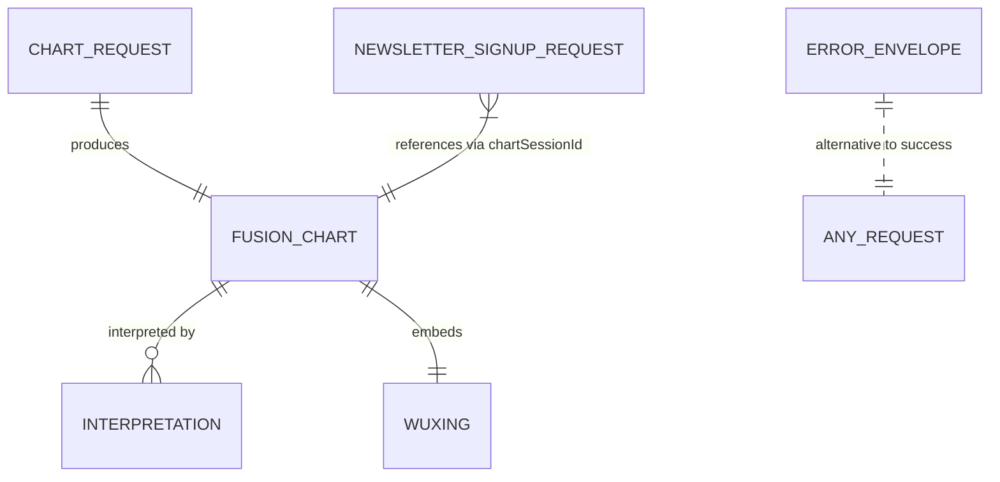
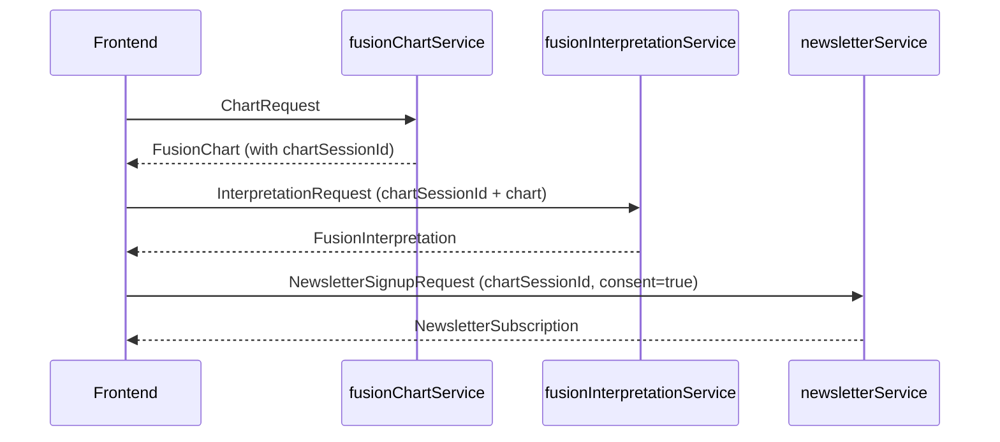

# Data Model

The Bazodiac FuFirE Fusion Preview has **no persistent state of its own**. All "data" lives either:

- **In-flight** as request/response DTOs over the public API contract;
- **Static** as JSON fixtures under `contracts/fixtures/` (stub mode only);
- **Delegated** to upstream provider services (live mode only — newsletter persistence in particular is owned by the newsletter vendor, not by this repository).

Therefore this document defines the DTO catalog, the invariants those DTOs must respect, and the identifier conventions that bind them across endpoints. Persistent storage decisions, schemas, and migrations are intentionally out of scope and would only be re-introduced if a future iteration takes ownership of newsletter or session storage.

## Entity Catalog

The diagram is **logical**, not physical. No table or row exists — the relationships describe how DTO instances reference one another inside a single user session.

## DTO Definitions

### `ChartRequest` — input to `POST /api/public/fusion-chart`

| Field | Type | Required | Invariant |
|---|---|---|---|
| `birthDate` | `string` | yes | ISO `YYYY-MM-DD` |
| `birthTime` | `string \| null` | yes | `HH:MM` or `null` (`REQ-F-null-birth-time-accepted`) |
| `birthPlace` | `string` | yes | non-empty |
| `timezone` | `string \| null` | no | IANA TZ identifier or `null` (server resolves) |
| `language` | `"de" \| "en"` | yes | enum (`REQ-USA-i18n-de-en-parity`) |

### `FusionChart` — payload returned by `/fusion-chart`, also embedded in `InterpretationRequest`

| Field | Type | Notes |
|---|---|---|
| `sunSign`, `moonSign` | `string` | English zodiac labels (12 values). |
| `ascendant` | `string \| null` | `null` when `birthTime: null` (provisional flag in service layer). |
| `baziYearAnimal` | `string` | English label (e.g. `"Horse"`). |
| `baziDaymaster` | `string` | English label (e.g. `"Geng"`). |
| `dominantElement` | `"Wood" \| "Fire" \| "Earth" \| "Metal" \| "Water"` | enum |
| `coherenceIndex` | `number` | range `[0, 1]` |
| `wuXing` | `WuXing` | see invariant below |
| `cosmicSignature` | `string` | display-only, opaque |
| `computedAt` | `string` | ISO 8601 UTC |

### `WuXing` — five-element distribution

| Field | Type |
|---|---|
| `wood`, `fire`, `earth`, `metal`, `water` | `number` |

**Invariant:** each value in `[0, 1]`; the five values sum to `~1.0` (rounding tolerance accepted by the frontend rendering scaler — UI multiplies by 100 for the progress bars).

### `InterpretationRequest` — input to `POST /api/public/fusion-interpretation`

| Field | Type | Required |
|---|---|---|
| `language` | `"de" \| "en"` | yes |
| `chartSessionId` | `string` | yes |
| `chart` | `FusionChart` | yes (full object passed back) |

### `FusionInterpretation` — payload returned by `/fusion-interpretation`

| Field | Type | Notes |
|---|---|---|
| `id` | `string` | opaque, prefix `int_` |
| `chartSessionId` | `string` | matches request |
| `language` | `"de" \| "en"` | matches request |
| `headline` | `string` | localized |
| `body` | `string` | multiline markdown, localized |
| `stats[]` | `{label, value}[]` | grid in modal |
| `downloads` | `{txt: string \| null, pdf: string \| null}` | URL or `null` (disables button) |
| `generatedAt` | `string` | ISO 8601 UTC |

### `NewsletterSignupRequest` — input to `POST /api/public/newsletter-signup`

| Field | Type | Required | Invariant |
|---|---|---|---|
| `email` | `string` | yes | RFC 5322-ish, validated server-side |
| `name` | `string` | yes | non-empty |
| `language` | `"de" \| "en"` | yes | enum |
| `consent` | `boolean` | yes | **must be `true`** (`REQ-SEC-consent-required`); `false` returns `CONSENT_REQUIRED` |
| `chartSessionId` | `string` | yes | back-reference to a prior chart |

### `NewsletterSubscription` — payload returned by `/newsletter-signup`

| Field | Type | Notes |
|---|---|---|
| `subscribed` | `boolean` | `true` on success including `ALREADY_SUBSCRIBED` soft-success |
| `subscription.id` | `string` | opaque, prefix `sub_` |
| `subscription.email` | `string` | echoes request |
| `subscription.confirmedAt` | `string` | ISO 8601 UTC |
| `subscription.doubleOptInRequired` | `boolean` | true means user must confirm via email |

### `ErrorEnvelope` — alternative to any success payload

| Field | Type | Notes |
|---|---|---|
| `ok` | `false` | discriminator (`REQ-F-stable-error-envelope`) |
| `error.code` | `string` | one of 13 frozen ALL_CAPS values (see `src/errors.mjs`) |
| `error.message` | `string` | human-readable, MUST NOT contain user PII (`REQ-SEC-no-pii-in-logs`) |
| `error.field` | `string` (optional) | only when the error pertains to a specific request field |

Frozen `error.code` values: `VALIDATION_ERROR`, `CONSENT_REQUIRED`, `INVALID_EMAIL`, `ALREADY_SUBSCRIBED`, `MALFORMED_JSON`, `UNSUPPORTED_MEDIA_TYPE`, `METHOD_NOT_ALLOWED`, `FUFIRE_UNAVAILABLE`, `INTERPRETATION_UNAVAILABLE`, `CONFIGURATION_ERROR`, `RATE_LIMITED`, `CHART_NOT_FOUND`, `INTERNAL_ERROR`.

## Internal Mapping: Public ↔ FuFirE Schema

Inside the `fufireProvider`, the public `ChartRequest` is translated into an upstream FuFirE `/v1/fusion` payload, and the response is mapped back into a public `FusionChart`. This mapping is the only place where the upstream schema appears.

| Public field | FuFirE outbound (`buildFufireRequest`) | FuFirE inbound (`mapFufireResponse`) |
|---|---|---|
| `birthDate` + `birthTime` | `payload.local_datetime` (`YYYY-MM-DDTHH:MM:SS`; noon fallback when `birthTime: null`, with `provisional` flag) | — |
| `timezone` | `payload.tz_id` | — |
| `birthPlace` (resolved) | `payload.geo_lat_deg`, `payload.geo_lon_deg` | — |
| — | `payload.dst_policy: "error"`, `bodies: null`, `include_validation: false`, `time_standard: "CIVIL"`, `day_boundary: "midnight"` (constants) | — |
| `chart.sunSign` | — | `positions.Sun.sign \|\| positions.sun.sign` |
| `chart.moonSign` | — | `positions.Moon.sign \|\| positions.moon.sign` |
| `chart.ascendant` | — | `ascendantSignFromDegrees(angles.Ascendant.degree, language)`; `null` when `provisional` |
| `chart.baziYearAnimal` | — | `bazi.pillars.year.animal` |
| `chart.baziDaymaster` | — | `bazi.day_master \|\| bazi.daymaster` |
| `chart.dominantElement` | — | `normalizeElement(wuxing.dominant_planet \|\| wuxing.dominant_bazi \|\| wuxing.dominant)` |
| `chart.coherenceIndex` | — | `wuxing.harmony_index` (number) |
| `chart.wuXing.{wood,fire,earth,metal,water}` | — | `wuxing.from_planets.{Holz/Wood, Feuer/Fire, ...}` (DE→EN normalized via `ELEMENT_DE_TO_EN`) |
| `chart.cosmicSignature` | — | `cosmic_signature \|\| cosmicSignature` |
| `chart.computedAt` | — | `computed_at \|\| computedAt \|\| now()` |

This mapping is the load-bearing piece that satisfies `REQ-F-fufire-chart-mapping` and is governed by `CON-fufire-chart-endpoint`.

## Identifier Conventions

| Identifier | Format | Source | Lifetime |
|---|---|---|---|
| `chartSessionId` | `fc_<6 hex chars>` | `randomBytes(3).toString('hex')` in `fusionChartService` | Within a single user session; never persisted server-side. Stub mode reuses the fixture's canonical value `fc_2719ae`. |
| Interpretation `id` | `int_<…>` | upstream interpretation provider | Vendor-owned in live mode; fixture-fixed in stub mode. |
| Subscription `id` | `sub_<…>` | upstream newsletter provider | Vendor-owned. |
| `error.code` | ALL_CAPS underscore-separated | `ERROR_CODES` in `src/errors.mjs` | Frozen; adding/renaming is a contract change. |

Identifiers are **opaque to the client**. The frontend treats them as round-trip-only strings — it does not parse, validate, or generate them.

## Lifecycle

A typical user session creates (and discards) DTO instances in this order:

No DTO is persisted by this repository. The newsletter signup is the only DTO that is persisted at all — by the newsletter vendor, not by this code.

## Constraints and Assumptions

- All DTO definitions are pinned to `contracts/public-api.md` (frozen for Iteration 2). A field rename or new required field is a contract change.
- `WuXing` sum tolerance is the responsibility of the upstream chart engine and the fixture authors; the adapter does not re-normalize.
- Identifier collision is implausible at preview-iteration traffic levels (`fc_<6 hex chars>` ≈ 16M values), but the format may need to grow (`fc_<8>`) if a future iteration takes ownership of session persistence.

## Requirement Coverage

| REQ | Covered by |
|---|---|
| [REQ-F-stable-error-envelope](../1-spec/requirements/REQ-F-stable-error-envelope.md) | `ErrorEnvelope` definition; frozen 13-code list |
| [REQ-F-null-birth-time-accepted](../1-spec/requirements/REQ-F-null-birth-time-accepted.md) | `ChartRequest.birthTime` accepts `null`; `FusionChart.ascendant` becomes `null` when provisional |
| [REQ-F-fufire-chart-mapping](../1-spec/requirements/REQ-F-fufire-chart-mapping.md) | Internal Mapping table |
| [REQ-SEC-consent-required](../1-spec/requirements/REQ-SEC-consent-required.md) | `NewsletterSignupRequest.consent` invariant |
| [REQ-SEC-no-pii-in-logs](../1-spec/requirements/REQ-SEC-no-pii-in-logs.md) | `error.message` field guidance — generic strings only |
| [REQ-USA-i18n-de-en-parity](../1-spec/requirements/REQ-USA-i18n-de-en-parity.md) | `language` enum on every relevant DTO |
